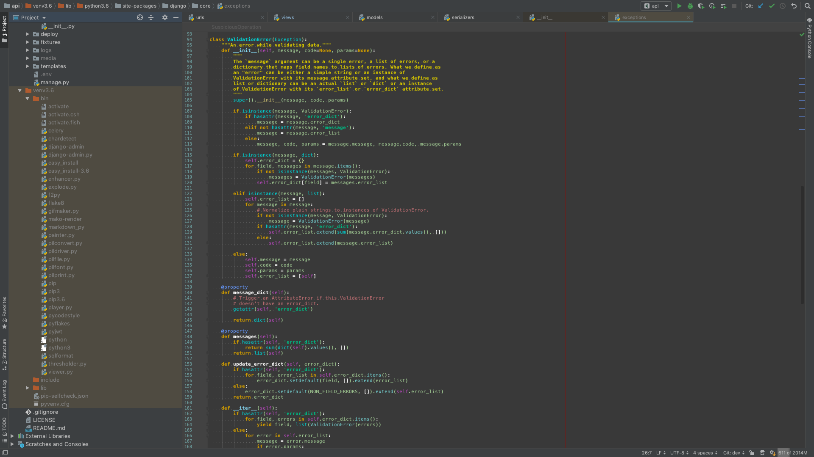
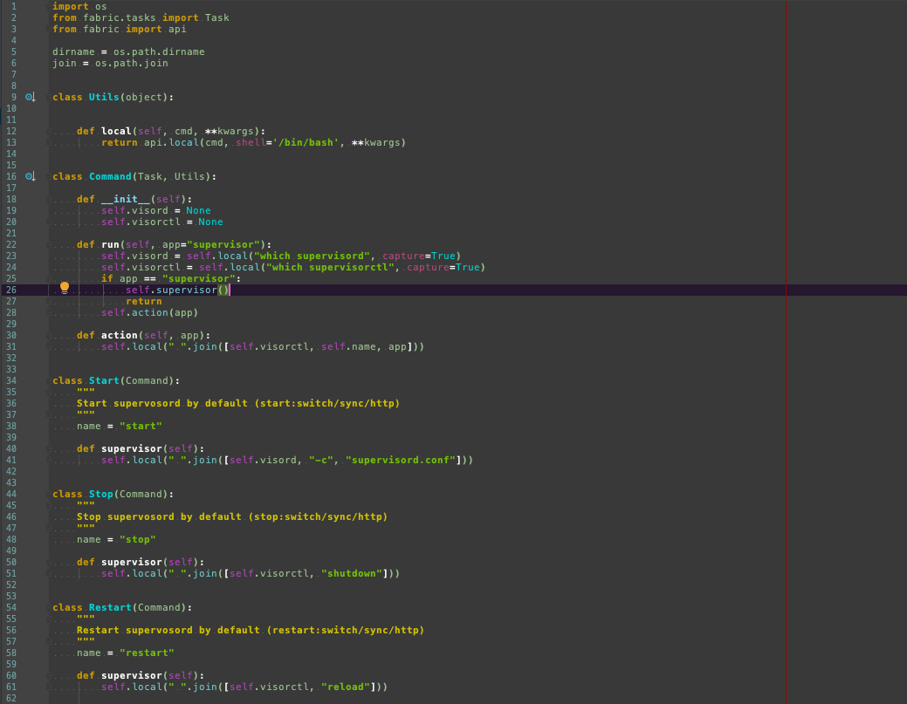
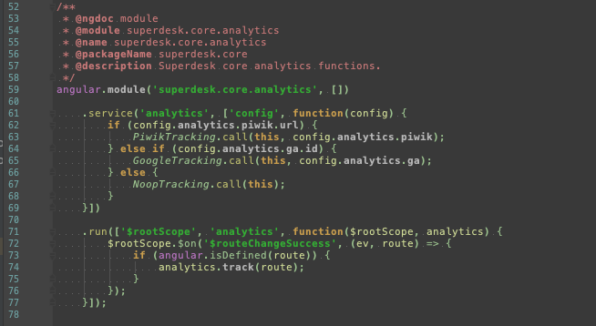

# relaxed-dark
Dark PyCharm theme :ok_hand:

## Installation

### Mac OS X
```
$ git clone https://github.com/ride90/relaxed-dark.git
$ cd relaxed-dark
$ cp relaxed-dark.icls ~/Library/Preferences/PyCharm2019.1/colors
```

### Linux
```
$ git clone https://github.com/ride90/relaxed-dark.git
$ cd relaxed-dark
$ cp relaxed-dark.icls ~/.PyCharm2019.1/config/colors/
```

:warning: Note that your pycharm version might be different.

## Examples

### Editor


### Python


### JS

